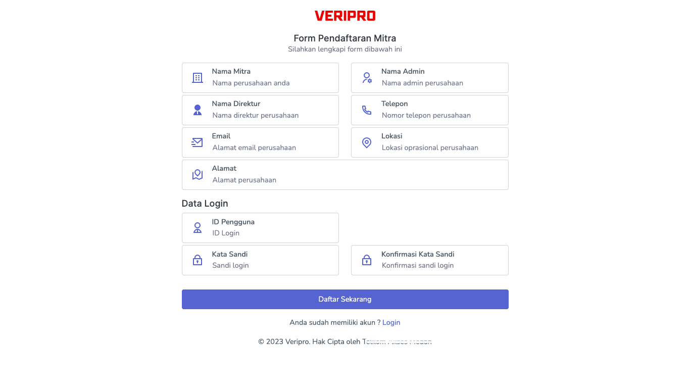
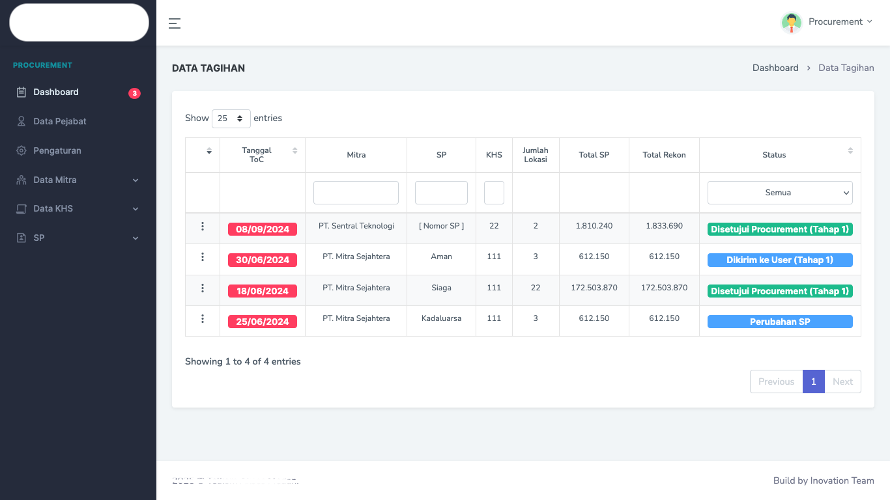

# Veripro - Vendor Billing Management System

**Veripro** is a billing management system developed for one of **Telecomunication Company in Medan**, designed to streamline collaboration between vendors and Company in the submission, revision, and approval process of billing documents in a transparent and structured manner.

## 🚀 Key Features

- Vendor account registration and approval
- Purchase Order (SP) issuance by the procurement team
- Uploading of billing documents and BAST by vendors
- Two-way revision process between vendor and Company
- Real-time billing status tracking
- Final approval and billing completion with print-ready documents

## 🖼️ Screenshots

### Vendor Registration Form


### Billing Lists Status


## 🛠️ Tech Stack

- **Framework:** Laravel 11  
- **Frontend:** Livewire 3, Bootstrap 4  
- **Database:** MySQL

## ⚙️ Installation & Setup

1. Clone this repository:
   ```bash
   git clone https://github.com/aldhi88/11-veripro.git
   cd 11-veripro
   ```

2. Install dependencies:
   ```bash
   composer install
   ```

3. Copy the `.env.example` file to `.env`, and configure your database settings.

4. Run the following commands:
   ```bash
   php artisan key:generate
   php artisan migrate
   php artisan app:init
   php artisan app:lov
   php artisan app:seeder
   ```

5. Start the local development server:
   ```bash
   php artisan serve
   ```

## 📄 Notes

This project was implemented internally for one of Telecomunication Company in Medan, reflecting the real business processes between vendors and the company. The system focuses on data validation, status transparency, and efficient document workflow.
